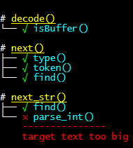
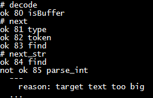

## trace-inline [](https://npmjs.org/package/trace-inline) [](https://npmjs.org/package/trace-inline) [](https://npmjs.org/package/trace-inline)

A better --trace-inlining

```sh
>trace-inline -h
USAGE: trace-inline <script>

Options:
  -h, --help      Show help                                            [boolean]
  -v, --version   Show version number                                  [boolean]
  -r, --reporter             [choices: "tape", "tree", "pass"] [default: "tree"]
```
### Reporters

Just pass your script as an argument and `trace-inline` will show you pretty human-readable output `trace-inline index.js`.



You can use any formatter you want to process the TAP output (`-r tape`). 



or get raw unparsed data (`-r pass`)


You can pass an additional arguments after `--`: `trace-inline -- --harmony-tailcalls index.js`

## Related

* [trace-inline-parse](https://github.com/ReklatsMasters/trace-inline-parse) - parser of `--trace-inlining` output from crankshaft

## License
MIT, 2017 (c) Dmitry Tsvettsikh
